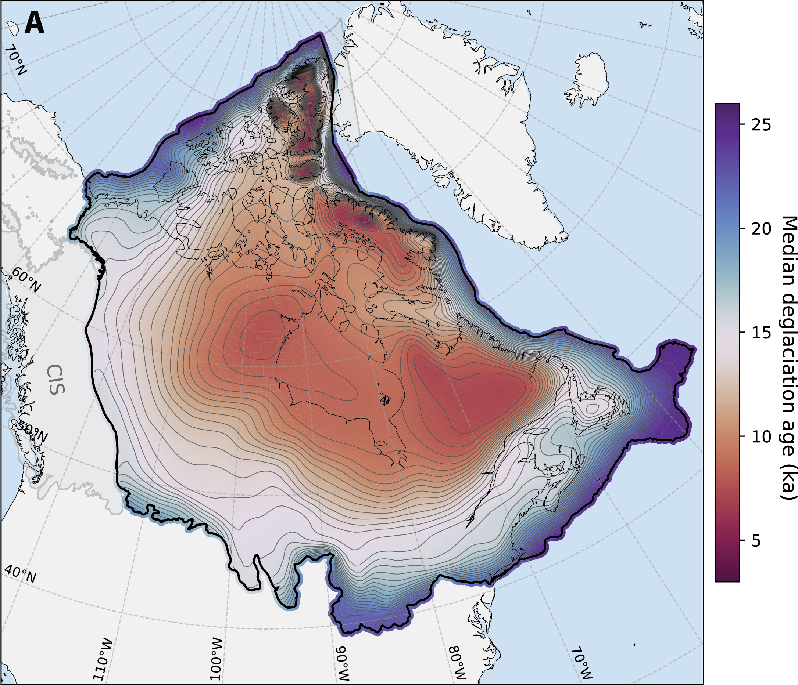

This tool provides quick estimates of deglaciation age for any location within the former Laurentide Ice Sheet (Innuitian Ice Sheet included, Cordilleran Ice Sheet excluded) based on our data-Assimilation-based Laurentide Ice Sheet (ALIS) reconstruction (Chester et al., in review).

Enter a latitude and longitude within the former Laurentide Ice Sheet extent to get the ALIS estimated deglaciation age at that location: the posterior mean, the 95% credible interval, and the full probability distribution. LIS extent here is defined using the maximum extent from Dalton et al. (2023).

Caution: this is a simple tool that interpolates from a posterior distribution of the ALIS reconstruction over a discrete grid. To make this work online, I've done some intepolation to reduce the amount of data. It still returns fairly accurate results, however, for final answers please refer to the full dataset (available here) or shoot me an email. I'm happy to help!

  <form id="deglaciation-form">
    

      

        <label for="deglaciation-lat">Latitude</label>
        <input type="number" id="deglaciation-lat" step="any" min="-90" max="90" placeholder="e.g. 45.5" required />
      

      

        <label for="deglaciation-lon">Longitude</label>
        <input type="number" id="deglaciation-lon" step="any" min="-180" max="180" placeholder="e.g. -75.7" required />
      

      

        <label>&nbsp;</label>
        <input type="submit" value="Look up" class="button" />
      

    

  </form>
  

  

    

      

      

    

    

      <canvas id="deglaciation-map" width="220" height="220" style="width:100%;height:auto;max-width:220px;"></canvas>
    

  

<h3>How ALIS was built:</h3>

In brief, the ALIS reconstruction uses a hierarchical Bayesian framework to infer a posterior distribution of deglaciation time for the LIS by assimilating geochronologic and geomorphic data with an ensemble of ice sheet models. The geochronologic constraints are from a recent North American compilation (9) that includes 10Be terrestrial cosmogenic nuclide (TCN) ages and calibrated radiocarbon ages, representing direct and age-limiting constraints on margin position, respectively. We supplement these ages with a dataset of mapped moraines and paleo ice streams that constrain margin geometry and retreat direction (9,37). We focus primarily on the LIS and exclude data associated with the Cordilleran Ice Sheet (CIS) except for a subset of CIS data west of the CIS-LIS saddle to capture the unzipping of the ice-free corridor. For the ice sheet models, we use a six-member ice sheet ensemble that reflects a diverse range of possible retreat scenarios. The models are weighted based on their fit to the data; consequently, in data-poor regions, rather than simply interpolating between locations, the posterior mean tends towards the learned (best-fit) ensemble prediction while still acknowledging the lack of constraints via high posterior uncertainty. The resolution of the reconstruction is controlled by the length-scales of covariance in the data and can therefore be thought of as providing the simplest, or smoothest, reconstruction given the constraints. Topography is not incorporated as information in the model, and thus, we expect to infer margins that are relatively smooth rather than confined by topographic features. Finally, we note that given this formulation, the ALIS can only capture the last time of deglaciation from a given location and cannot reproduce the build-up to the LGM extent or local re-advances.

