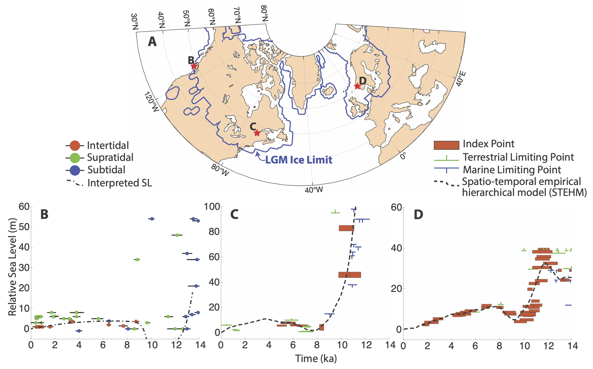

<h2 id="1">Paleo Sea Level and Glacial Isostatic Adjustment</h2>

The rate of modern sea level rise is spatially and temporally variable. One of the processes driving these spatial patterns is Glacial Isostatic Adjustment (GIA), which is the deformation in Earth's solid surface, geoid and rotational axis due to changes in ice and ocean load. To better understand modern GIA, I study past changes in sea-level and how they are driven by GIA processes. 

<h3 id="1">Mid-Holocene sea-level </h3>

GIA drove spatially variabily sea-level change along Northern Hemisphere coastlines during the Holocene. Near the margins of former ice sheets is a unique pattern of change characterised by sea level fall interrupted by a brief (1-3 kyr) period of rise, or transgression. The origins of this mid-Holocene transgression have been previously debated. We used a quite of GIA model simulations to show that the transgression was likely driven by a geodynamics process--we term 'reverse migration' of the peripheral bulge. We show how this previously unidentified process arises from a contrast in viscosty between Earth's upper and lower mantle. Finally, we use observations of the transgression to constrain this contrast in viscosity below the former Laurentide and Fennoscandian ice sheets. This work is published in Quaternary Science Reviews  <a href="https://doi.org/10.1016/j.quascirev.2024.108986">(Chester et al., 2024)</a>.

<h3 id="1">FastGIA: a GIA model in Julia </h3>

GIA models are available in a number of programming languages and from multiple research groups. We (Roger Creel and I)translated a 1D GIA model originally written in Matlab by Jacqueline Austermann to the Julia Programming Language to gain some speed and efficiency. The code is publicly available on <a href="https://github.com/rcameronc/FastGIA.jl">github</a>. Feel free to reach out with any questions about the code!

<h2 id="1">Feedbacks between GIA and Marine-based Ice Sheets</h2>

Ice sheets are highly sensitive to changes in local topography and relative sea level. Over glacial cycles, sea level variations are primarily controlled by ice volume changes and GIA. As ice sheets grow and shrink they change the local topography and gravity field both of which modulate relative sea level. Such effects can result in critical feedbacks between GIA and ice sheet dynamics, notably the possible stabilization of the grounding line during ice mass loss. 
I developed a new coupled model to further understand how these modeling decisions influence the predicted dynamics and ultimately our understanding of ice sheet-sea level interaction. I coupled a widely used GIA model with the open-source, thermomechanical Parallel Ice Sheet Model (PISM). The GIA model solves the ‘sea level equation’, assumes a 1D maxwell viscoelastic Earth structure and accounts for rotational feedbacks. I am currently using the model to explore the evolution of the Antarctic ice sheet during the mid to late Holocene.

<h2 id="1">Modern thinning and associated isostatic uplift of the Juneau Icefield</h2>

Alaskan glaciers are thinning at an alarming rate (Berthier et al. 2010). Among them, the Juneau Icefield has been melting at an accelerating rate since the Little Ice Age (Davies et al., 2024). To better understand this thinning and how it drives GIA and local sea-level changes, we conducted a repeat GPS survey in 2025 to reoccupy sites originally measured in the early 1990s. I led this work as part of my teaching faculty role at the <a href="https://www.juneauicefield.org/">Juneau Icefield Research Program</a>. The survey was largely driven by the incredible work of the students. 
We found average uplift rates of 2.1 and 2.5 cm/yr at two sites over the period 1992 to 2025. These are the first measurements of isostatic rebound taken directly on the JIF and they are higher than predicted by previously published models. This unscores the importance of campaign surveys to monitor uplift near melting icefield rather than relying on permenant installations near towns and cities.

JIRP has been conducitng GPS surveys of glacier surface elevation (relative to bedrock) since the early 1990s, led largely by researcher <a href="http://crevassezone.org/">Scott McGee</a>. These data are unevenly distributed in both time and space, yet they provide remarkable coverage of the southern half of the icefield. This has a number of advantages over remote sensing data which are generally noise on the upper accumulation zone. I used a Bayesian framework to derive a model a spatiotemporal field of surface change with quantified uncertianty. The statistical model shows overal accerating surface lowering over the last few decades. We also find a strong spatial gradient with the majority of the lowering occuring on the eastern interior portion of the icefield. 

<h2 id="1">SWAIS2C: Sensitivity of the West Antarctic Ice Sheet to 2 degrees C of Warming</h2>
